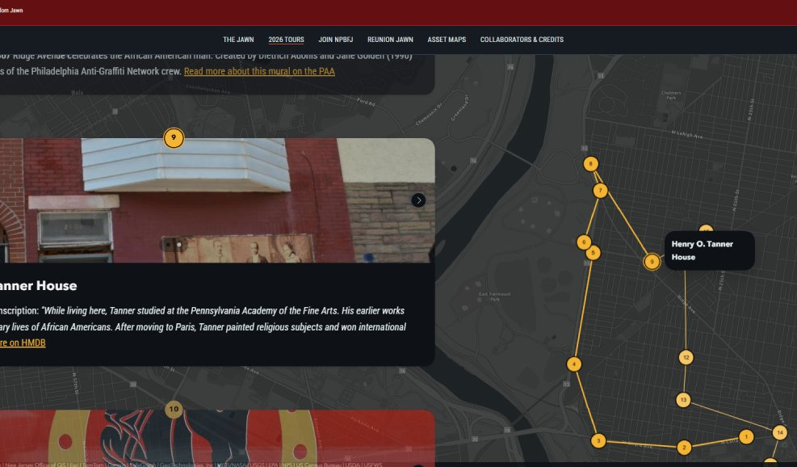

### Project Brief

Developed GIS-based asset maps documenting North Philadelphia’s Black cultural, historic, and civic landscape. Conducted site visits and community-based research with local leaders and organizations to validate places and incorporate lived experience and intergenerational knowledge into the spatial record. Translated this research into interactive ArcGIS StoryMaps and virtual tours that connect individual sites to broader neighborhood histories, creating accessible digital tools for public history, community engagement, and place-based planning as part of Philadelphia’s 2026 Semiquincentennial.

