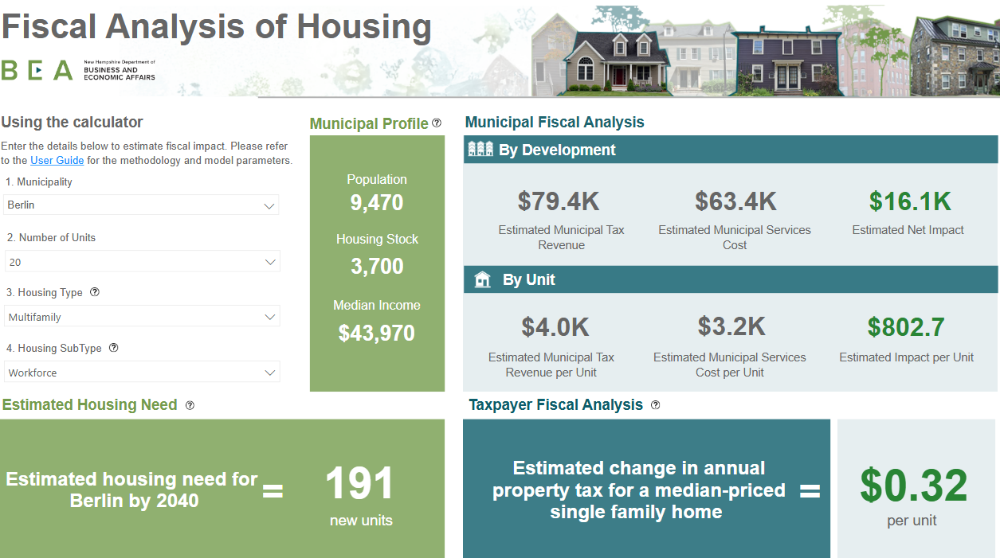

### Project Brief

New Hampshire Department of Business and Economic Affairs commissioned my team at Econsult Solutions to develop a dashboard that estimates the fiscal impacts of building new units. The dashboard allows users to input details of a hypothetical housing development and informs them of the municipal costs and revenues estimated for that project. This tool has been developed as a resource for municipal decision makers and residents alike. The dashboard reframes the often hard to understand fiscal implications of housing in a dynamic, interactive platform that simplifies complex data. Designed with usability in mind, the Housing Needs Dashboard allows users to engage directly with localized data on municipal costs, revenues, and taxpayer impacts.  

